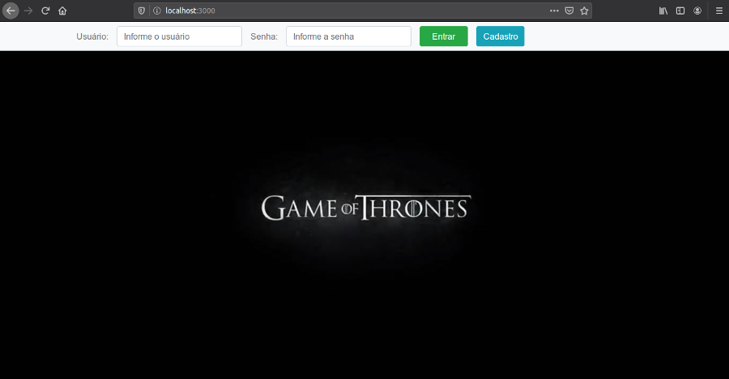

# G.O.T MMORPG

A MMORPG project based on [Game of Thrones](https://en.wikipedia.org/wiki/Game_of_Thrones) TV series. This application was made with Node.js and many other features - see ["Built With"](#built-with) section for more details.

## GETTING STARTED 🚀

> **_This project is under construction_**

These instructions will get you a copy of the project up and running on your local machine for development and testing purposes. See deployment for notes on how to deploy the project on a live system.

### PREREQUISITES 📋

- [Node Js](https://nodejs.org/) - A JavaScript runtime built on Chrome's V8 JavaScript engine.
- [MongoDB](https://www.mongodb.com/) - A general purpose, document-based and distributed database.

### INSTALLING 🔧

Clone this repository by pasting this command on your terminal/prompt:

```
git clone https://github.com/FranSantiago/mmorpg_got.git
```

Change to the new repository:

```
cd mmorpg_got
```

If Node.js is installed, then, install packages dependencies with npm:

```
npm i
```

Create a .env file by copying .env.example:

```
cp .env.example .env
```

Start the server by typing:

```
npm run dev
```

Now, open browser window and type:

```
localhost:3000
```

You will "get" the login page as follows (language: pt-br):



## BUILT WITH

- [Bcrypt](https://github.com/kelektiv/node.bcrypt.js) - A library to help you hash passwords.
- [Bootstrap](https://getbootstrap.com/) - An open source toolkit for developing with HTML, CSS and JS.
- [Consign](https://github.com/jarradseers/consign) - Consign is used to autoload models, routes, schemas, configs, controllers, object maps.
- [EJS](https://ejs.co/) - Embbeded JavaScript Templating.
- [Express Framework](https://expressjs.com/) - Fast, unopinionated, minimalist web framework for Node.js.
- [Express-session](https://github.com/expressjs/session) - An Express middleware to manage sessions.
- [Express-validator](https://github.com/express-validator/express-validator) - An express.js middleware for [validator](https://github.com/chriso/validator.js).
- [MongoDB](https://www.mongodb.com/) - A general purpose, document-based and distributed database.
- [Mongoose](https://mongoosejs.com/) - Elegant MongoDB object modeling for Node.js.
- [Node Js](https://nodejs.org/) - A JavaScript runtime built on Chrome's V8 JavaScript engine.

## AUTHOR

- **Françoar Santiago** - _Full Stack developer_ - [@fransantiago](https://github.com/fransantiago) on GitHub

## LICENSE 📄

This project is licensed under the MIT License - see the [LICENSE.md](LICENSE.md) file for details
